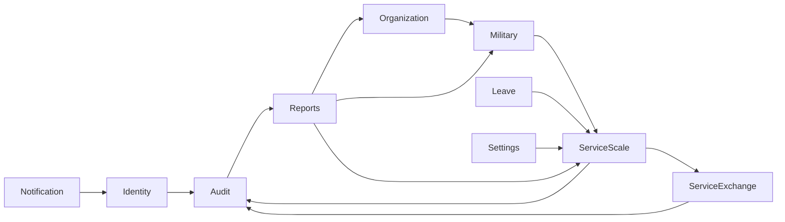

# Domain Model

Este documento e a referencia oficial do modelo de dominio do SIGESM Enterprise.
Ele descreve bounded contexts atuais e previstos, dependencias permitidas e o
context map para evolucao dos modulos.

## Bounded Contexts

### Identity

Contexto previsto para autenticacao, usuarios, perfis, permissoes e sessoes.

- Entidades principais: User, Profile, Permission, Session.
- Aggregate Roots: User, Profile.
- Value Objects: Username, PasswordHash, Email, PermissionCode.
- Repositorios: IUserRepository, IProfileRepository.
- Servicos de dominio: PasswordPolicyService, PermissionEvaluationService.
- Eventos: UserCreated, UserLocked, PasswordChanged.

### Organization

Contexto ja iniciado para organizacoes militares.

- Entidades principais: Organization.
- Aggregate Roots: Organization.
- Value Objects: OrganizationCode, OrganizationName, Abbreviation, City, State, Country.
- Repositorios: IOrganizationRepository.
- Specifications: OrganizationCodeAlreadyExists.
- Eventos: OrganizationCreated.

### Military

Contexto ja iniciado para cadastro e ciclo de vida do militar.

- Entidades principais: MilitaryPerson.
- Aggregate Roots: MilitaryPerson.
- Value Objects: MilitaryId, FullName, CPF, Rank, Phone, MilitaryStatus.
- Repositorios: IMilitaryRepository.
- Eventos: MilitaryRegistered.

### ServiceScale

Contexto ja iniciado para escalas, designacoes, elegibilidade e geracao.

- Entidades principais: ServiceScale, ServiceAssignment, ServiceRole.
- Aggregate Roots: ServiceScale.
- Value Objects: ScaleType, ServiceDate, RestPeriod, AssignmentStatus, ServiceRoleName.
- Repositorios: IServiceScaleRepository.
- Servicos de dominio: EligibilityEngine, CandidateSelector, FairnessService,
  RestCalculationService.
- Engines: ScaleGenerationEngine.
- Policies: EligibilityPolicy, GenerationPolicy, FairnessPolicy, MinimumRestPolicy,
  TieBreakPolicy.
- Specifications: HasMinimumRest, MilitaryActive, MilitaryNotOnLeave,
  MilitaryNotRestricted, MilitaryQualifiedForRole, MilitaryCompatibleScale.
- Eventos: ServiceAssignmentCreated, ServiceAssignmentCancelled,
  MilitaryDeclaredEligible, MilitaryDeclaredIneligible, ScaleGenerated,
  MilitarySelected, MilitarySkipped.

### ServiceExchange

Contexto ja iniciado para troca oficial e venda de servico.

- Entidades principais: OfficialSwap, ServiceSale.
- Aggregate Roots: OfficialSwap, ServiceSale.
- Value Objects: ExchangeReason, ExchangeStatus, ExchangeType.
- Repositorios: IServiceExchangeRepository.
- Engines: SwapValidationEngine, ServiceSaleEngine.
- Policies: OfficialSwapPolicy, ServiceSalePolicy.
- Eventos: OfficialSwapApproved, OfficialSwapRejected, ServiceSaleApproved,
  ServiceSaleRejected.

### Leave

Contexto previsto para afastamentos, dispensas e indisponibilidades.

- Entidades principais: LeaveRequest, MedicalLeave, OperationalRestriction.
- Aggregate Roots: LeaveRequest.
- Value Objects: LeavePeriod, LeaveReason, LeaveStatus.
- Repositorios: ILeaveRepository.
- Eventos: LeaveApproved, LeaveRejected, LeaveCancelled.

### Audit

Contexto previsto para rastreabilidade de decisoes e acoes.

- Entidades principais: AuditEntry, DecisionRecord.
- Aggregate Roots: AuditEntry.
- Value Objects: ActorId, ActionName, AuditMetadata.
- Repositorios: IAuditRepository.
- Eventos: AuditEntryRecorded, AutomaticDecisionRecorded.

### Notification

Contexto previsto para avisos internos e comunicacoes.

- Entidades principais: Notification, NotificationRecipient.
- Aggregate Roots: Notification.
- Value Objects: NotificationMessage, NotificationChannel, NotificationStatus.
- Repositorios: INotificationRepository.
- Eventos: NotificationCreated, NotificationDelivered, NotificationFailed.

### Reports

Contexto previsto para consultas, relatorios e exportacoes.

- Entidades principais: ReportDefinition, ReportExecution.
- Aggregate Roots: ReportDefinition.
- Value Objects: ReportFilter, ReportFormat, ReportPeriod.
- Repositorios: IReportRepository.
- Eventos: ReportGenerated, ReportExported.

### Settings

Contexto previsto para parametros operacionais do sistema.

- Entidades principais: SystemSetting, ScaleSetting.
- Aggregate Roots: SystemSetting.
- Value Objects: SettingKey, SettingValue, SettingScope.
- Repositorios: ISettingsRepository.
- Eventos: SettingChanged.

## Dependencias Permitidas

- ServiceScale pode consultar contratos de Military, Organization, Leave e Settings.
- ServiceExchange pode consultar contratos de ServiceScale, Military e Audit.
- Reports pode consultar modelos de leitura de todos os contextos.
- Audit pode receber eventos de todos os contextos, sem acoplar regras de negocio.
- Notification pode consumir eventos, sem alterar agregados de origem.
- Nenhum contexto deve acessar infraestrutura concreta de outro contexto.

## Context Map

