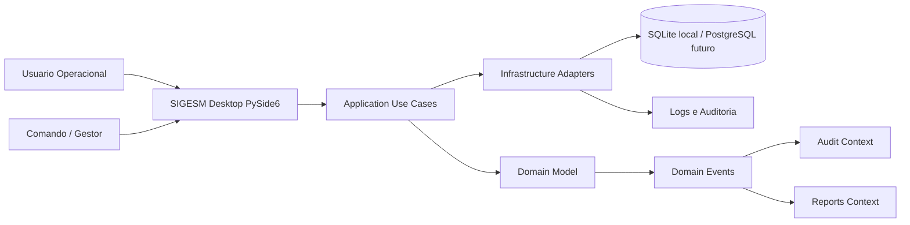

# Context Diagram

```mermaid
flowchart LR
    Operator["Usuario Operacional"] --> Desktop["SIGESM Desktop PySide6"]
    Commander["Comando / Gestor"] --> Desktop
    Desktop --> Application["Application Use Cases"]
    Application --> Domain["Domain Model"]
    Application --> Infrastructure["Infrastructure Adapters"]
    Infrastructure --> Database[("SQLite local / PostgreSQL futuro")]
    Infrastructure --> Logs["Logs e Auditoria"]
    Domain --> Events["Domain Events"]
    Events --> Audit["Audit Context"]
    Events --> Reports["Reports Context"]
```
