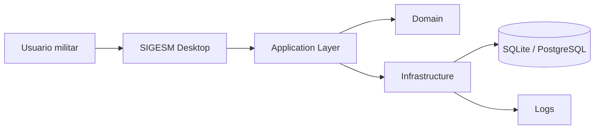

# Contexto

```mermaid
flowchart LR
    User["Usuario militar"] --> UI["SIGESM Desktop"]
    UI --> App["Application Layer"]
    App --> Domain["Domain"]
    App --> Infra["Infrastructure"]
    Infra --> DB[("SQLite / PostgreSQL")]
    Infra --> Logs["Logs"]
```
