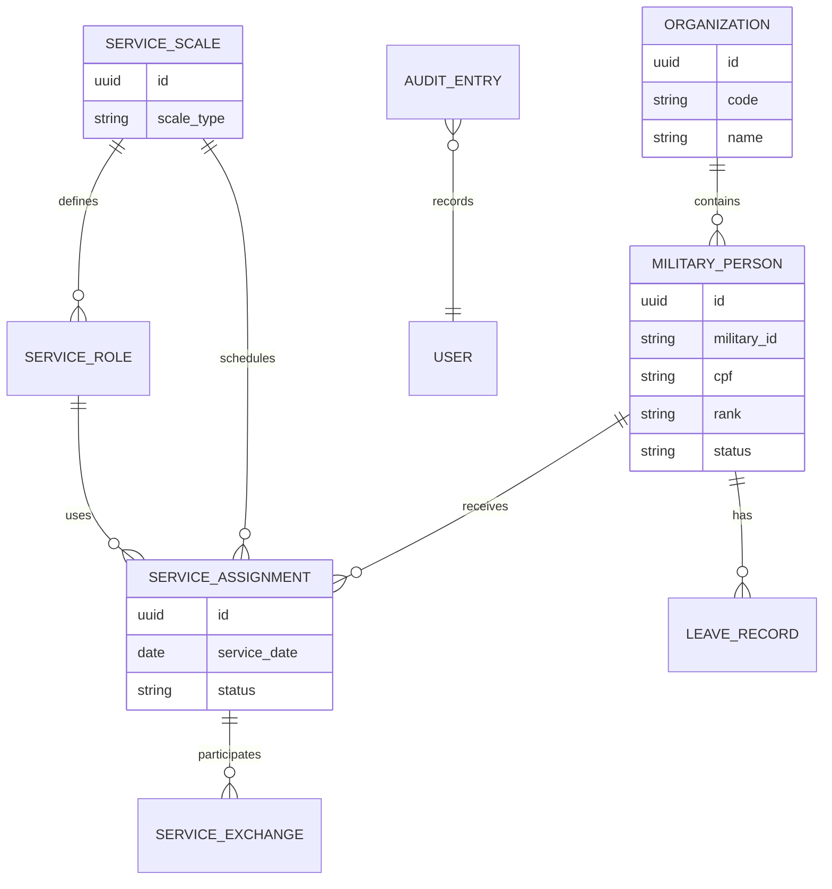

# Database Conceptual Diagram

```mermaid
erDiagram
    ORGANIZATION ||--o{ MILITARY_PERSON : contains
    MILITARY_PERSON ||--o{ SERVICE_ASSIGNMENT : receives
    SERVICE_SCALE ||--o{ SERVICE_ROLE : defines
    SERVICE_SCALE ||--o{ SERVICE_ASSIGNMENT : schedules
    SERVICE_ROLE ||--o{ SERVICE_ASSIGNMENT : uses
    SERVICE_ASSIGNMENT ||--o{ SERVICE_EXCHANGE : participates
    MILITARY_PERSON ||--o{ LEAVE_RECORD : has
    AUDIT_ENTRY }o--|| USER : records

    ORGANIZATION {
        uuid id
        string code
        string name
    }
    MILITARY_PERSON {
        uuid id
        string military_id
        string cpf
        string rank
        string status
    }
    SERVICE_SCALE {
        uuid id
        string scale_type
    }
    SERVICE_ASSIGNMENT {
        uuid id
        date service_date
        string status
    }
```
