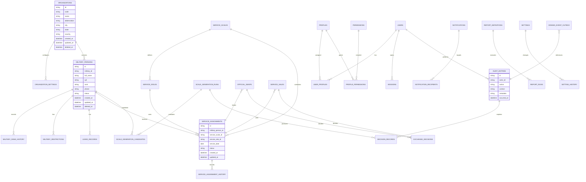

# Database ER

Diagrama ER conceitual planejado para orientar futuras migrations. Ele nao
representa tabelas ja criadas.

```mermaid
erDiagram
    ORGANIZATIONS ||--o{ ORGANIZATION_SETTINGS : configures
    ORGANIZATIONS ||--o{ MILITARY_PERSONS : contains
    MILITARY_PERSONS ||--o{ MILITARY_RANK_HISTORY : records
    MILITARY_PERSONS ||--o{ MILITARY_RESTRICTIONS : has
    MILITARY_PERSONS ||--o{ LEAVE_RECORDS : has

    SERVICE_SCALES ||--o{ SERVICE_ROLES : defines
    SERVICE_SCALES ||--o{ SERVICE_ASSIGNMENTS : schedules
    SERVICE_ROLES ||--o{ SERVICE_ASSIGNMENTS : uses
    MILITARY_PERSONS ||--o{ SERVICE_ASSIGNMENTS : receives
    SERVICE_ASSIGNMENTS ||--o{ SERVICE_ASSIGNMENT_HISTORY : records

    SCALE_GENERATION_RUNS ||--o{ SCALE_GENERATION_CANDIDATES : evaluates
    SCALE_GENERATION_RUNS ||--o{ DECISION_RECORDS : produces
    MILITARY_PERSONS ||--o{ SCALE_GENERATION_CANDIDATES : candidate

    OFFICIAL_SWAPS }o--|| SERVICE_ASSIGNMENTS : swaps
    SERVICE_SALES }o--|| SERVICE_ASSIGNMENTS : sells
    OFFICIAL_SWAPS ||--o{ EXCHANGE_DECISIONS : decides
    SERVICE_SALES ||--o{ EXCHANGE_DECISIONS : decides

    USERS ||--o{ USER_PROFILES : has
    PROFILES ||--o{ USER_PROFILES : assigned
    PROFILES ||--o{ PROFILE_PERMISSIONS : grants
    PERMISSIONS ||--o{ PROFILE_PERMISSIONS : included
    USERS ||--o{ SESSIONS : opens

    USERS ||--o{ AUDIT_ENTRIES : performs
    AUDIT_ENTRIES ||--o{ DECISION_RECORDS : explains
    DOMAIN_EVENT_OUTBOX }o--|| AUDIT_ENTRIES : references

    NOTIFICATIONS ||--o{ NOTIFICATION_RECIPIENTS : targets
    REPORT_DEFINITIONS ||--o{ REPORT_RUNS : executes
    SETTINGS ||--o{ SETTING_HISTORY : changes

    ORGANIZATIONS {
        string id
        string code
        string name
        string abbreviation
        string city
        string state
        string country
        datetime created_at
        datetime updated_at
        datetime deleted_at
    }

    MILITARY_PERSONS {
        string id
        string military_id
        string full_name
        string cpf
        string rank
        string phone
        string status
        datetime created_at
        datetime updated_at
        datetime deleted_at
    }

    SERVICE_ASSIGNMENTS {
        string id
        string military_person_id
        string service_scale_id
        string service_role_id
        date service_date
        string status
        datetime created_at
        datetime updated_at
    }

    AUDIT_ENTRIES {
        string id
        string actor_id
        string action
        string context
        string metadata
        datetime occurred_at
    }
```
