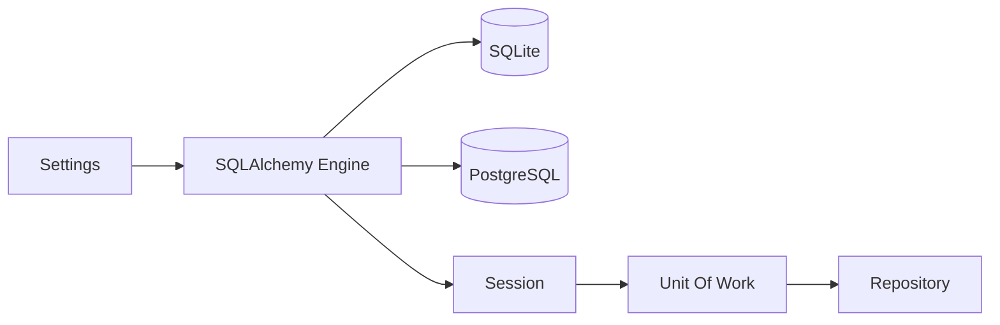

# Banco de Dados

```mermaid
flowchart LR
    Settings["Settings"] --> Engine["SQLAlchemy Engine"]
    Engine --> SQLite[("SQLite")]
    Engine --> PostgreSQL[("PostgreSQL")]
    Engine --> Session["Session"]
    Session --> UOW["Unit Of Work"]
    UOW --> Repository["Repository"]
```
