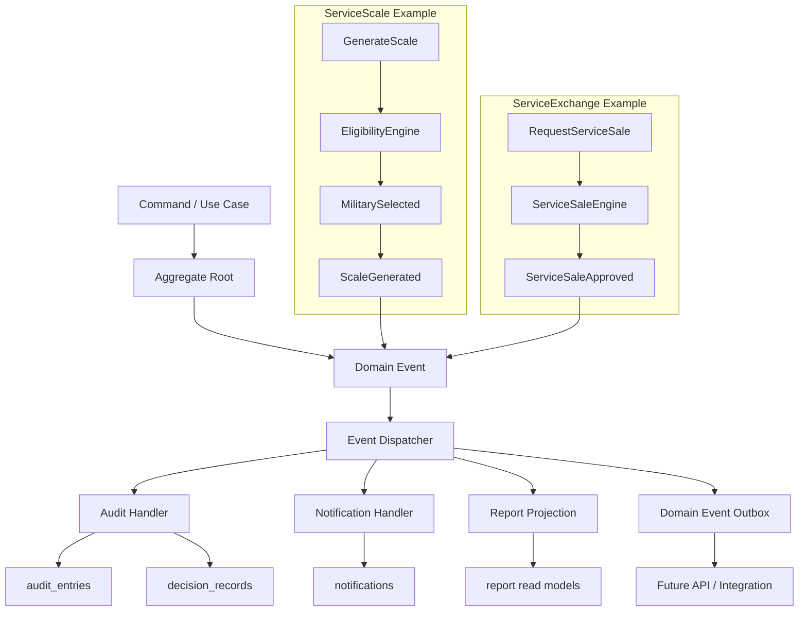

# Event Flow

Fluxo conceitual de eventos de dominio, auditoria e futuras integracoes.

```mermaid
flowchart TB
    Command["Command / Use Case"] --> Aggregate["Aggregate Root"]
    Aggregate --> DomainEvent["Domain Event"]
    DomainEvent --> Dispatcher["Event Dispatcher"]
    Dispatcher --> AuditHandler["Audit Handler"]
    Dispatcher --> NotificationHandler["Notification Handler"]
    Dispatcher --> ReportProjection["Report Projection"]
    Dispatcher --> Outbox["Domain Event Outbox"]

    AuditHandler --> AuditEntry["audit_entries"]
    AuditHandler --> DecisionRecord["decision_records"]
    NotificationHandler --> Notification["notifications"]
    ReportProjection --> ReportReadModel["report read models"]
    Outbox --> FutureAPI["Future API / Integration"]

    subgraph ServiceScale["ServiceScale Example"]
        GenerateScale["GenerateScale"]
        Eligibility["EligibilityEngine"]
        Selected["MilitarySelected"]
        Generated["ScaleGenerated"]
        GenerateScale --> Eligibility
        Eligibility --> Selected
        Selected --> Generated
    end

    subgraph ServiceExchange["ServiceExchange Example"]
        RequestSale["RequestServiceSale"]
        SaleEngine["ServiceSaleEngine"]
        SaleApproved["ServiceSaleApproved"]
        RequestSale --> SaleEngine
        SaleEngine --> SaleApproved
    end

    Generated --> DomainEvent
    SaleApproved --> DomainEvent
```
