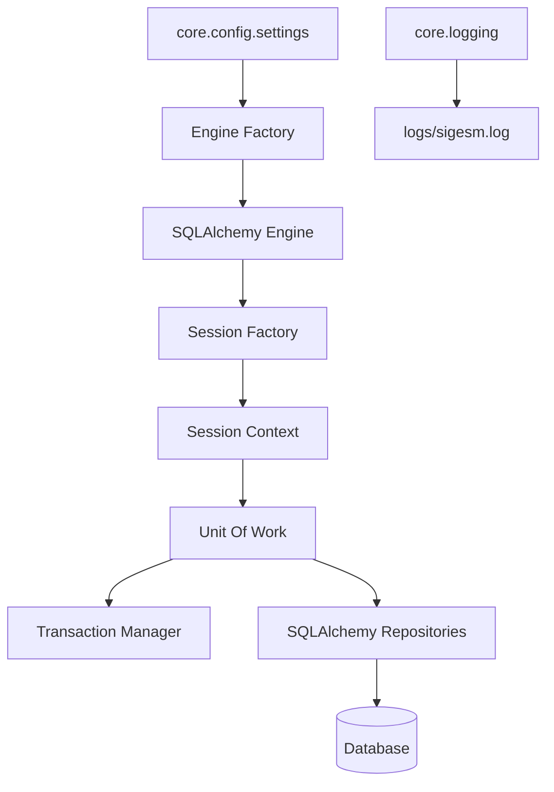

# Infrastructure Diagram

```mermaid
flowchart TB
    Settings["core.config.settings"] --> EngineFactory["Engine Factory"]
    EngineFactory --> Engine["SQLAlchemy Engine"]
    Engine --> SessionFactory["Session Factory"]
    SessionFactory --> SessionContext["Session Context"]
    SessionContext --> UOW["Unit Of Work"]
    UOW --> Transaction["Transaction Manager"]
    UOW --> Repositories["SQLAlchemy Repositories"]
    Repositories --> Database[("Database")]
    Logging["core.logging"] --> Logs["logs/sigesm.log"]
```
