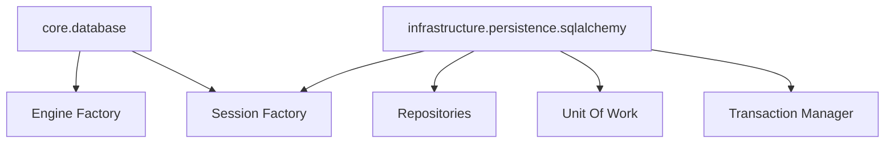

# Infraestrutura

```mermaid
flowchart TB
    CoreDB["core.database"] --> Engine["Engine Factory"]
    CoreDB --> Session["Session Factory"]
    Persistence["infrastructure.persistence.sqlalchemy"] --> Session
    Persistence --> Repositories["Repositories"]
    Persistence --> UOW["Unit Of Work"]
    Persistence --> Transactions["Transaction Manager"]
```
