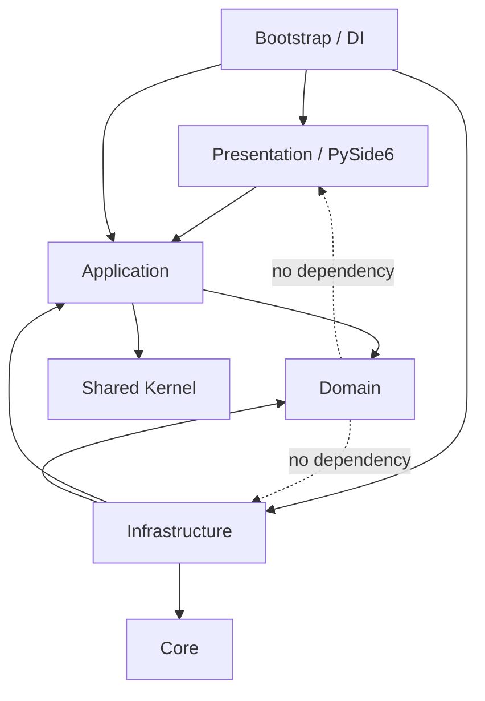

# Layers Diagram

```mermaid
flowchart TB
    UI["Presentation / PySide6"] --> App["Application"]
    App --> Domain["Domain"]
    App --> Shared["Shared Kernel"]
    Infra["Infrastructure"] --> App
    Infra --> Domain
    Infra --> Core["Core"]
    Bootstrap["Bootstrap / DI"] --> UI
    Bootstrap --> App
    Bootstrap --> Infra
    Domain -. no dependency .-> UI
    Domain -. no dependency .-> Infra
```
