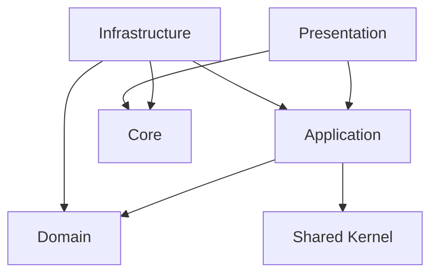

# Camadas

```mermaid
flowchart TB
    Presentation["Presentation"] --> Application["Application"]
    Application --> Domain["Domain"]
    Application --> Shared["Shared Kernel"]
    Infrastructure["Infrastructure"] --> Application
    Infrastructure --> Domain
    Infrastructure --> Core["Core"]
    Presentation --> Core
```
