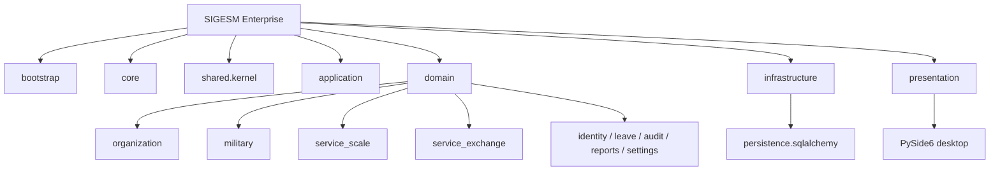

# Modules Diagram

```mermaid
flowchart TB
    Root["SIGESM Enterprise"] --> Bootstrap["bootstrap"]
    Root --> Core["core"]
    Root --> Shared["shared.kernel"]
    Root --> Application["application"]
    Root --> Domain["domain"]
    Root --> Infrastructure["infrastructure"]
    Root --> Presentation["presentation"]

    Domain --> Organization["organization"]
    Domain --> Military["military"]
    Domain --> ServiceScale["service_scale"]
    Domain --> ServiceExchange["service_exchange"]
    Domain --> Future["identity / leave / audit / reports / settings"]

    Infrastructure --> Persistence["persistence.sqlalchemy"]
    Presentation --> Desktop["PySide6 desktop"]
```
