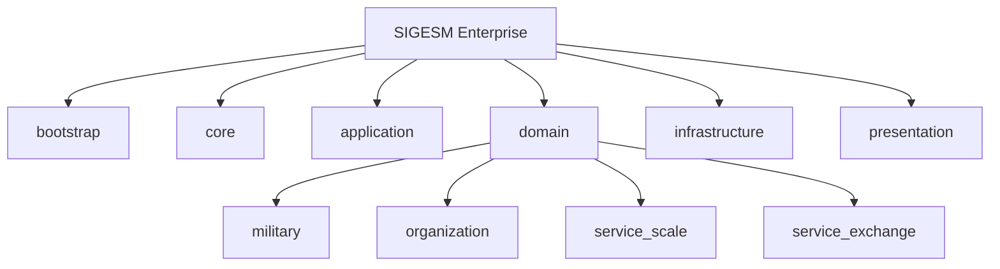

# Modulos

```mermaid
flowchart TB
    SIGESM["SIGESM Enterprise"] --> Bootstrap["bootstrap"]
    SIGESM --> Core["core"]
    SIGESM --> Application["application"]
    SIGESM --> Domain["domain"]
    SIGESM --> Infrastructure["infrastructure"]
    SIGESM --> Presentation["presentation"]
    Domain --> Military["military"]
    Domain --> Organization["organization"]
    Domain --> ServiceScale["service_scale"]
    Domain --> ServiceExchange["service_exchange"]
```
